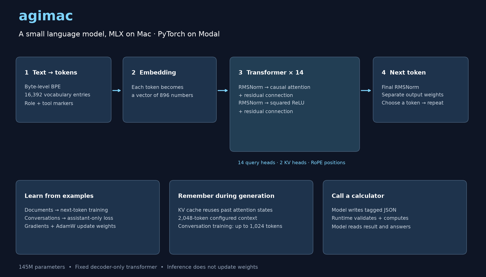
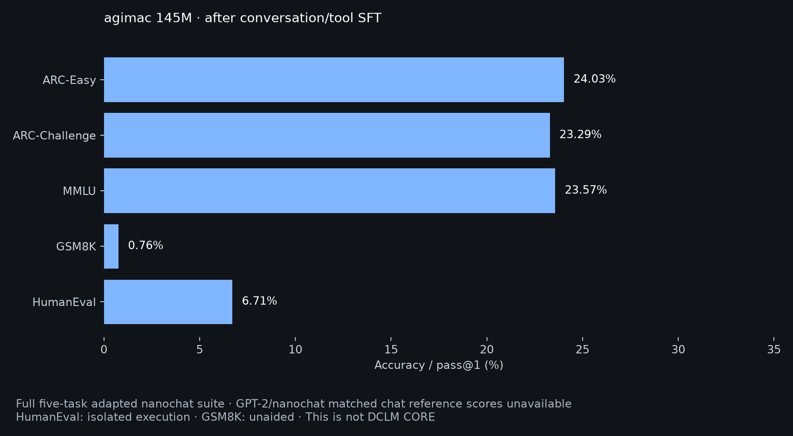

# agimac

**Train language models from scratch on Apple silicon or Modal GPUs, then run them locally with MLX.**

A complete toolkit with a live training dashboard, chat CLI, calculator tools and reproducible evaluations.



## Train on your Mac

Apple silicon, Python 3.12 and [uv](https://docs.astral.sh/uv/).

```sh
git clone https://github.com/ashleyrudland/agimac.git
cd agimac
uv sync --locked --extra data --extra dev

# Download and prepare 20 million tokens from the public training mixture.
uv run python experiments/prepare_general.py --root data/my-corpus --tokens 20000000 --expanded

# Train a 72M model. Start small, then increase your budget.
uv run agimac train --config configs/nano-core-72m.json \
  --data data/my-corpus/prepared --output runs/my-model \
  --steps 1000 --sequence 512 --batch-size 2 --accumulate 1 \
  --dtype bfloat16 --master-weights --compile-step
```

The browser dashboard opens automatically. Training and inference run locally; downloads need internet. Start with a small batch to avoid swapping. Disable browser launch with `AGIMAC_DASHBOARD=0`.

**Choose your scale:** use `configs/nano-core-72m.json` or `configs/nano-core-145m.json`, or copy a config and edit its layers/width. `--tokens` above sets the **corpus size**; training processes approximately `steps × sequence × batch-size × accumulate` tokens. The example processes 1.024M tokens. Repeated exposure is not new data. Training a small pilot does not produce the reference model's quality.

## Try a checkpoint

```sh
# Base models complete text.
uv run agimac generate --model runs/my-model/step-001000 --prompt 'def square(x):' --tokens 64

# Conversation-trained checkpoints support chat.
uv run agimac chat --model path/to/chat-checkpoint --temperature 0
uv run python -m macoder.dashboard --run runs/my-model --open

# Quantize and measure inference speed.
uv run agimac quantize --model path/to/chat-checkpoint --output runs/chat-q4 --bits 4
uv run agimac bench --model runs/chat-q4 --prompt-tokens 128 --tokens 256
```

Checkpoint downloads are **not published yet**. Inference needs `config.json`, `metadata.json`, `tokenizer.json` and `model.safetensors`. Package inference files with `uv run python experiments/export_release.py --model CHECKPOINT --output releases/agimac-v1`.

## Train on Modal

The CUDA backend uses the same model architecture and prepared token files. Its inference checkpoints load directly into MLX.

```sh
uv sync --locked --extra cloud --extra data --extra dev
uv run python -m modal setup

# Paid, bounded H100 probe using the corpus prepared above.
uv run python -m modal run trainers/cloud.py --run-name my-h100-probe \
  --data data/my-corpus/prepared --config configs/nano-core-72m.json \
  --upload --batch-size 64 --max-steps 150 --max-seconds 600
```

Start with the probe before committing to a long run. `trainers/pipeline.py::launch` prepares the fixed 2B-token corpus in the cloud and runs the 145M/11B-token recipe. `trainers/cloud_sft.py` adds conversation/tool training using the reference checkpoint and data paths. Inspect those paths before launching. For bounded pretraining resume, pass `--resume previous-run/step-000150` to `trainers/cloud.py` with a new run name and unchanged data/schedule. Modal bills your account; commands do not include a spending allowance.

## What we measured

| Reference run | Result |
|---|---:|
| Parameters | 144,979,968 |
| Pretraining | 11B processed tokens from a 2B-token corpus |
| H100 pretraining | ~375K tokens/s; ~8.44 hours including evaluation/saving |
| Conversation/tool SFT | 72.93M input tokens; 51.19M assistant targets |
| M2 Pro Q4 inference | ~442.5 tokens/s |
| HumanEval, greedy pass@1 | 6.71% (11/164) |
| GSM8K, unaided | 0.76% (10/1,319) |
| ARC-Easy / ARC-Challenge / MMLU | 24.03% / 23.29% / 23.57% |

Inference speed used a 128-token prompt and 256-token decode, median of three warm runs. It is not training speed. Benchmarks used BF16 weights and an adapted nanochat protocol. These scores are **not** the DCLM CORE leaderboard. HumanEval ran in isolated Modal sandboxes; GSM8K used no Python tool. Training-data overlap cannot be ruled out.



Pretraining mixture: **40% FineWeb-Edu, 30% Cosmopedia, 20% license-filtered CodeParrot Python, 10% TinyStories**. SFT: **150,000 Smol-SmolTalk conversations and 15,450 generated, checked calculator examples**. Dataset revisions, filters, reference tokenizer and hashes live in `recipes/`. Fixed data does not guarantee identical scores across hardware or random-number implementations.

Calculator JSON is generated by the model, validated by the runtime and executed using four arithmetic tools. This does not grant arbitrary shell access. General tool use and long context are not established: configured context is 2,048 tokens, not 300K.

## Inside the code

- `src/macoder/model.py`: MLX transformer; `backends/torch_model.py`: CUDA counterpart.
- `train.py` / `sft.py`: document training / assistant-only conversation training.
- `conversation.py` / `chat.py`: message format, validated calculator calls and chat.
- `trainers/`: local and cloud entry points. `experiments/`: data builders and evaluations.

```sh
uv sync --locked --extra dev --extra data --extra eval --extra cloud
uv run ruff check src trainers experiments tests
uv run ruff format --check src trainers experiments tests
uv run pytest -q
```

The two byte-pinned dataset builders are deliberately excluded from formatting. Historical source hashes are evidence of past runs; never replace them just to bypass a mismatch. MLX and CUDA share inference weights; optimizer resume states are backend-specific.

## References

[Transformer](https://arxiv.org/abs/1706.03762) · [RoPE](https://arxiv.org/abs/2104.09864) · [GQA](https://arxiv.org/abs/2305.13245) · [RMSNorm](https://arxiv.org/abs/1910.07467) · [Primer / squared ReLU](https://arxiv.org/abs/2109.08668) · [QK normalization](https://arxiv.org/abs/2010.04245) · [nanochat](https://github.com/karpathy/nanochat/tree/92d63d4e8bb4df75c3b71618f31ddde2378b2bcd).

### nanochat attribution

agimac's `nano_core` architecture draws on Andrej Karpathy's [nanochat implementation](https://github.com/karpathy/nanochat/blob/92d63d4e8bb4df75c3b71618f31ddde2378b2bcd/nanochat/gpt.py), pinned at `92d63d4e8bb4df75c3b71618f31ddde2378b2bcd`. This influence includes Q/K RMS normalization, squared-ReLU feed-forward layers, parameter-free RMSNorm, separate output weights and logit soft-capping. Our MLX/PyTorch implementations, model dimensions and training recipe differ; this is not an exact nanochat reproduction. Legacy checkpoints also support SwiGLU and tied embeddings.

The CORE protocol helpers and chat-evaluation formatting/scoring also use or adapt nanochat code. Copyright (c) 2025 Andrej Karpathy. We retain the [nanochat MIT license](experiments/nanochat-LICENSE.txt).

```bibtex
@software{Karpathy_nanochat,
  author = {Karpathy, Andrej},
  title = {nanochat},
  url = {https://github.com/karpathy/nanochat},
  version = {92d63d4e8bb4df75c3b71618f31ddde2378b2bcd}
}
```

## Citation

```bibtex
@software{Rudland_agimac_2026,
  author = {Rudland, Ashley},
  title = {{agimac: Train and Run Language Models on Apple Silicon}},
  url = {https://github.com/ashleyrudland/agimac},
  version = {0.1.0},
  year = {2026}
}
```

## License

MIT. See [LICENSE](LICENSE). Third-party attribution is retained in [experiments/nanochat-LICENSE.txt](experiments/nanochat-LICENSE.txt).
